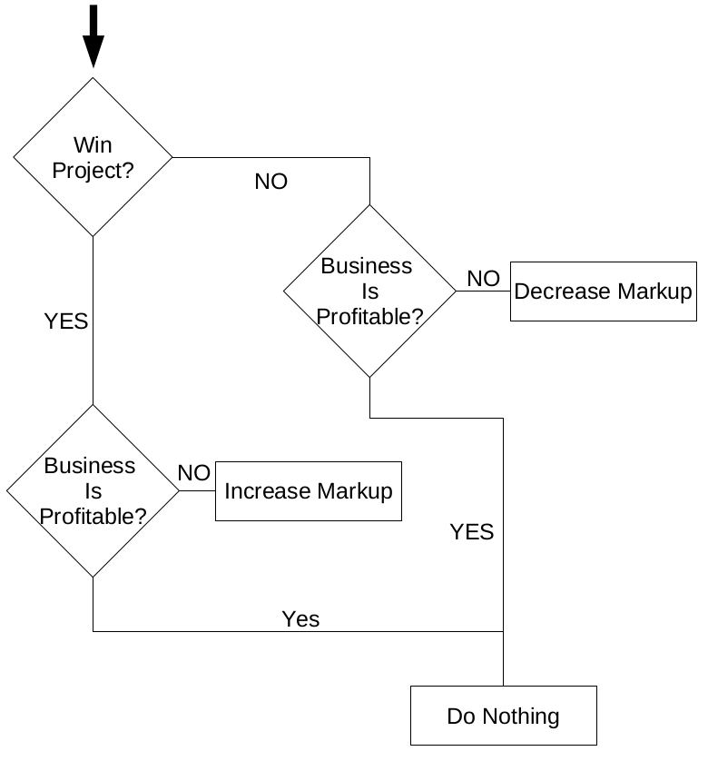

# Construction Bidding Simulation using Agent-Based Modeling

## What is is this?
A simulation of contractors bidding
for projects, using Agent-Based modelling.

## How to run it?
Run main.py
```
python main.py
```

## Where are the outputs?
Plots are created in `./plots/`

## How does it work
This is a simulation, using agent-based modeling, of constractors bidding. Each contractor has an error distribution and a markup factor. The error distribution controls the error of the contractor's bid. The markup is the markup for the bid. After each bid, depending on whether the contractor wins or looses, according to the following figure.



## Current work

For some reason, a contractor dominates the market. Why does that happen?

